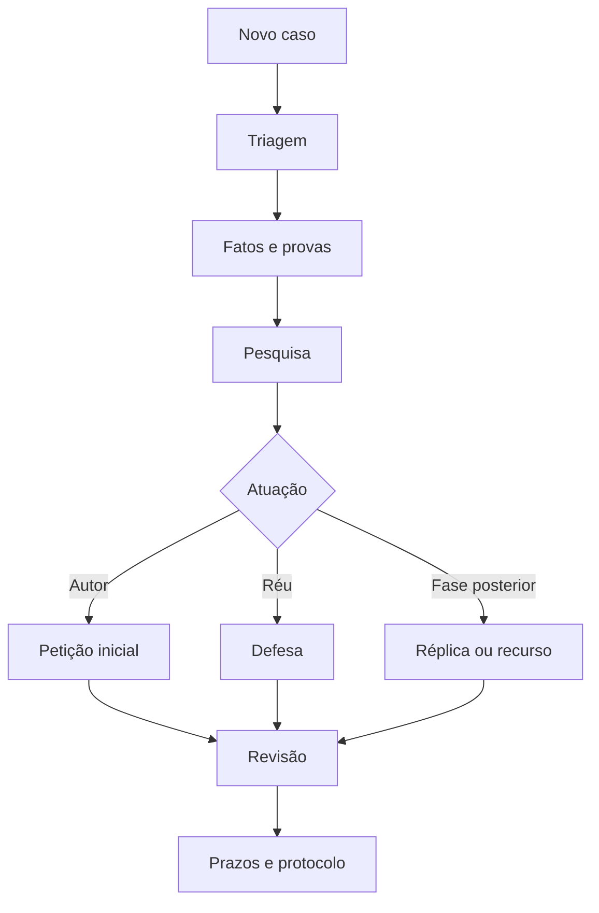

<div align="center">

# ⚖️ Advocacia Brasil para Claude

### Dez skills para pesquisa, estratégia, redação, revisão e organização do cotidiano jurídico brasileiro

[](https://claude.ai/)
[](https://agentskills.io/)
[](#)
[](LICENSE)

Pesquisa verificável · Peças estruturadas · Prazos organizados · Revisão humana obrigatória

</div>

---

## Navegação

- [Visão geral](#visão-geral)
- [O que está incluído](#o-que-está-incluído)
- [Instalação no Claude Web](#instalação-no-claude-web)
- [Instalação no Claude Desktop](#instalação-no-claude-desktop)
- [Guia das dez skills](#guia-das-dez-skills)
- [Fluxos combinados](#fluxos-combinados)
- [Pesquisa jurídica e fontes](#pesquisa-jurídica-e-fontes)
- [Memória de prazos](#memória-de-prazos)
- [Segurança e limites](#segurança-e-limites)
- [Desenvolvimento e distribuição](#desenvolvimento-e-distribuição)
- [Documentação](#documentação)

## Visão geral

Este repositório reúne skills focadas em tarefas recorrentes da advocacia brasileira. O Claude identifica a tarefa, carrega a skill relevante e segue um procedimento estruturado para reduzir omissões, citações inexistentes, confusão entre fatos e alegações e peças desconectadas das provas.

As skills são compatíveis com o Claude no navegador e com o aplicativo Claude Desktop, desde que **Code execution and file creation** e **Skills** estejam habilitados na conta.

> [!IMPORTANT]
> As skills apoiam o trabalho jurídico, mas não substituem a revisão, o julgamento profissional e a responsabilidade do advogado. Prazos, competência, vigência, fontes, cálculos, documentos e protocolo devem ser conferidos.

## O que está incluído

| # | Skill | Principal resultado |
|---:|---|---|
| 1 | [Triagem e estratégia jurídica](skills/triagem-estrategia-juridica/SKILL.md) | Caso estruturado, riscos, alternativas e diligências |
| 2 | [Pesquisa jurídica brasileira](skills/pesquisa-juridica-brasileira/SKILL.md) | Legislação e jurisprudência verificadas |
| 3 | [Organização de fatos e provas](skills/organizar-fatos-provas/SKILL.md) | Cronologia e matriz probatória |
| 4 | [Elaboração de petição inicial](skills/elaborar-peticao-inicial/SKILL.md) | Inicial completa e checklist de anexos |
| 5 | [Elaboração de defesa processual](skills/elaborar-defesa-processual/SKILL.md) | Contestação e matriz de impugnação |
| 6 | [Réplica e manifestações](skills/elaborar-replica-manifestacao/SKILL.md) | Resposta específica à defesa e documentos |
| 7 | [Recursos e contrarrazões](skills/elaborar-recurso-juridico/SKILL.md) | Análise de cabimento e minuta recursal |
| 8 | [Execução e cumprimento de sentença](skills/execucao-cumprimento-sentenca/SKILL.md) | Estratégia executiva ou defensiva |
| 9 | [Revisão técnica de peças](skills/revisar-peca-juridica/SKILL.md) | Auditoria pré-protocolo por severidade |
| 10 | [Gestão de prazos e providências](skills/gerenciar-prazos-providencias/SKILL.md) | Agenda jurídica, prazo interno e acompanhamento |

## Instalação no Claude Web

1. Acesse [Claude.ai](https://claude.ai/).
2. Abra **Settings > Capabilities** e habilite **Code execution and file creation**.
3. Abra **Customize > Skills**.
4. Clique em **+ > Create skill > Upload a skill**.
5. Faça upload de um arquivo ZIP gerado na pasta `dist/`.
6. Repita para cada skill desejada e mantenha-as ativadas.

Para gerar os ZIPs localmente:

```bash
python scripts/validate_and_package.py
```

Consulte o [guia oficial de custom skills](https://support.claude.com/en/articles/12512198-how-to-create-custom-skills).

## Instalação no Claude Desktop

O Claude Desktop utiliza as skills associadas à mesma conta:

1. Atualize o aplicativo para a versão mais recente.
2. Entre com a mesma conta utilizada no Claude Web.
3. Habilite **Code execution and file creation**.
4. Abra **Customize > Skills** no aplicativo ou no navegador.
5. Envie os ZIPs de `dist/` e ative as skills.
6. Abra uma nova conversa e descreva naturalmente a tarefa.

Em organizações Team ou Enterprise, um proprietário pode provisionar skills para todos os membros ou distribuir um conjunto por grupo. Veja [distribuição organizacional](https://support.claude.com/en/articles/13119606-provision-and-manage-skills-for-your-organization).

## Guia das dez skills

### 1. Triagem e estratégia jurídica

Transforma o relato inicial em fatos confirmados, lacunas, cronologia, questões jurídicas, riscos e opções estratégicas.

**Use quando:** chegar um caso novo, uma consulta ou um conjunto desorganizado de informações.

**Exemplo:**

> Analise este conflito contratual representando a empresa contratante. Separe fatos comprovados, lacunas e riscos, e compare negociação, notificação e ação judicial.

### 2. Pesquisa jurídica brasileira

Pesquisa legislação, precedentes qualificados, jurisprudência e atos regulatórios. Prioriza fontes oficiais e usa o JusBrasil como fonte complementar de descoberta, sempre exigindo confirmação no órgão ou tribunal de origem.

**Use quando:** precisar fundamentar consulta, peça, parecer, contrato ou decisão.

**Exemplo:**

> Pesquise a validade desta cláusula limitativa de responsabilidade. Traga legislação vigente, precedentes do STJ, divergências e links oficiais.

### 3. Organização de fatos e provas

Inventaria documentos, constrói cronologia, relaciona alegações a evidências e identifica contradições e provas faltantes.

**Use quando:** houver e-mails, contratos, comprovantes, conversas ou muitos anexos.

**Exemplo:**

> Organize os documentos anexados em cronologia e relacione cada possível inadimplemento à prova correspondente.

### 4. Elaboração de petição inicial

Valida competência, legitimidade, procedimento, prescrição, tutela e causa de pedir antes de montar fatos, fundamentos, pedidos e anexos.

**Use quando:** o caso estiver suficientemente estruturado e documentado.

**Exemplo:**

> Elabore uma petição inicial de cobrança empresarial usando apenas os documentos anexados. Marque dados ausentes como [PREENCHER].

### 5. Elaboração de defesa processual

Mapeia cada alegação adversa, examina preliminares e produz defesa específica com tese principal, alternativa e estratégia probatória.

**Use quando:** receber ação, reclamação ou procedimento que exija resposta.

**Exemplo:**

> Prepare a contestação representando a empresa ré. Responda cada alegação, examine prescrição e avalie reconvenção.

### 6. Réplica e manifestações

Compara inicial, defesa e documentos novos para responder preliminares, fatos controvertidos, provas e argumentos sem repetir desnecessariamente a peça anterior.

**Use quando:** responder contestação, laudo, cálculos ou documento novo.

**Exemplo:**

> Elabore a réplica, responda às preliminares e identifique os fatos que ficaram incontroversos.

### 7. Recursos e contrarrazões

Verifica cabimento, prazo, preparo e filtros de admissibilidade, decompõe a decisão em fundamentos e estrutura razões recursais específicas.

**Use quando:** houver sentença, decisão interlocutória, acórdão ou recurso adverso.

**Exemplo:**

> Analise a sentença, diga se a apelação é recomendável e enfrente todos os fundamentos autônomos da decisão.

### 8. Execução e cumprimento de sentença

Examina título, exigibilidade, prescrição, dispositivo, cálculos e medidas executivas. Também auxilia na defesa por excesso, pagamento, nulidade ou inexigibilidade.

**Use quando:** iniciar ou responder execução e cumprimento de sentença.

**Exemplo:**

> Prepare o cumprimento definitivo e organize principal, juros, correção, multa e honorários com premissas auditáveis.

### 9. Revisão técnica de peças

Audita aspectos formais, fatos, fontes, lógica, pedidos, anexos, sigilo e riscos. Classifica achados como críticos, altos, médios ou baixos.

**Use quando:** uma peça estiver pronta para revisão final.

**Exemplo:**

> Revise esta contestação sem reescrevê-la integralmente. Aponte bloqueios de protocolo e correções prioritárias.

### 10. Gestão de prazos e providências

Organiza intimações, tarefas, responsáveis e dependências. Adota prazo interno padrão de **2 dias antes** do prazo externo e mantém o arquivo `controle-de-prazos.md`.

**Use quando:** receber intimação, distribuir trabalho ou consultar a agenda.

**Exemplos:**

> Registre estes três prazos, calcule o prazo interno de 2 dias e indique dependências.

> O que eu tenho para fazer hoje?

## Fluxos combinados



### Nova ação

Triagem → Fatos e provas → Pesquisa → Petição inicial → Revisão → Prazos.

### Defesa

Prazos → Triagem → Fatos e provas → Pesquisa → Defesa → Revisão.

### Recurso

Prazos → Pesquisa → Recurso → Revisão.

## Pesquisa jurídica e fontes

A skill de pesquisa utiliza uma hierarquia de autoridade:

1. Constituição e controle concentrado;
2. legislação e atos vigentes;
3. precedentes vinculantes e qualificados;
4. jurisprudência do tribunal competente;
5. atos do regulador;
6. doutrina e agregadores.

O JusBrasil integra a pesquisa como ferramenta complementar para localizar materiais e ampliar termos. A conclusão deve ser confirmada no Planalto, Diário Oficial, tribunal ou órgão emissor.

## Memória de prazos

A skill de prazos utiliza `controle-de-prazos.md` como registro operacional.

- Em um Projeto ou Cowork com arquivos persistentes, o Claude pode atualizar o registro.
- Em uma conversa isolada, o estado pode existir apenas naquele chat.
- Sem o arquivo disponível, o Claude deve informar que não possui memória persistente e pedir os dados atuais.
- A skill nunca deve inventar compromissos ao responder “O que tenho para fazer hoje?”.

O modelo do registro está em [`references/controle-de-prazos-template.md`](skills/gerenciar-prazos-providencias/references/controle-de-prazos-template.md).

## Segurança e limites

- Não inclua senhas, tokens ou certificados digitais nas skills.
- Minimize dados pessoais e documentos de clientes.
- Prefira repositório privado para materiais internos.
- Não use notícia ou agregador como substituto de fonte primária.
- Não protocole texto gerado sem revisão humana.
- Confirme prazo no sistema processual e calendário oficial.
- Verifique números, datas, cálculos, competência, anexos e citações.

Leia a [política de segurança](SECURITY.md) antes de incluir modelos ou dados internos.

## Desenvolvimento e distribuição

Validar e gerar os pacotes:

```bash
python scripts/validate_and_package.py
```

O script:

- valida nomes e metadados;
- exige `SKILL.md`;
- confere o limite das descrições;
- verifica referências relativas;
- bloqueia marcadores inacabados;
- gera um ZIP por skill em `dist/`;
- garante que cada ZIP contenha a pasta da skill como raiz.

O workflow do GitHub Actions executa as mesmas verificações e publica os ZIPs como artefato.

## Documentação

- [Instalação detalhada](docs/INSTALACAO.md)
- [Guia de uso e prompts](docs/GUIA-DE-USO.md)
- [Segurança, sigilo e LGPD](SECURITY.md)
- [Contribuição e atualização](CONTRIBUTING.md)

---

<div align="center">

Desenvolvido para apoiar uma advocacia mais organizada, verificável e responsável.

</div>
